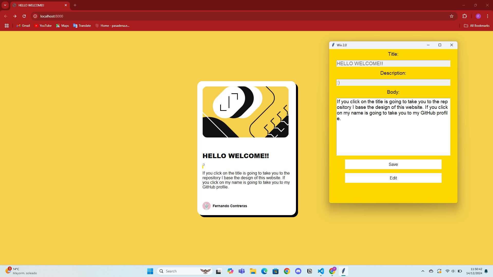
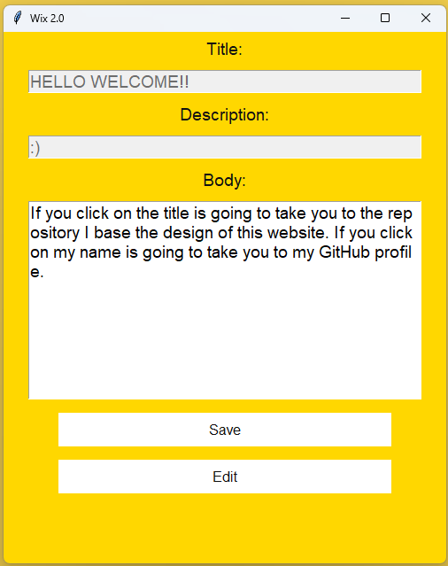
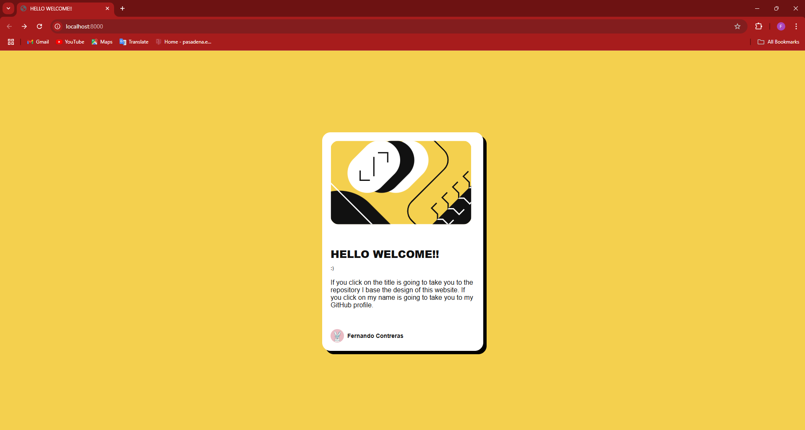

# Gui-aplication HTML Editor and Web Server Solution

This is a solution for a final project in the Programming with Python course. It includes a GUI application to edit a webpage's title, description, and body text, saving changes to a JSON file and regenerating the HTML file. It also includes a server to host the generated webpage.

---

## Table of Contents
- [Overview](#overview)
  - [Screenshot](#screenshot)
  - [Features](#features)
  - [Links](#links)
- [How It Works](#how-it-works)
  - [Structure](#structure)
  - [Technologies Used](#technologies-used)
- [My Process](#my-process)
  - [Challenges](#challenges)
  - [What I Learned](#what-i-learned)
- [Author](#author)
- [Acknowledgments](#acknowledgments)

---

## Overview

### Screenshot

#### Editor GUI

#### Generated Webpage

---

### Features
- A user-friendly GUI to edit webpage content (title, description, and body).
- Automatically updates and saves content to a JSON file.
- Generates an HTML file styled to match the project theme.
- A web server to host the generated webpage.

---

### Links  
- **Repository URL**: [Repository GUI Program](https://github.com/fernandojosecc/gui-aplication)  
- **Style Repository URL**: [Blog preview card](https://github.com/fernandojosecc/blog-preview-card)  

---
## How It Works

### Structure
1. **editor_gui.py** - The main GUI application for editing the webpage.
2. **html_generator.py** - Module that generates the HTML file from JSON content.
3. **server.py** - A Flask-based server to serve the generated webpage.
4. **page_content.json** - Stores the content of the webpage (title, description, and body).
5. **index.html** - The generated webpage file.

### Technologies Used
- **Python** for application logic.
- **Tkinter** for the graphical user interface.
- **Flask** for serving the webpage.
- **HTML/CSS** for the webpage design.
- **JSON** for data storage.

---

## My Process

### Challenges
- Adding style to the GUI 
- Synchronizing changes between the JSON, HTML, and the server.
- Ensuring a good user experience for editing and saving content.

### What I Learned
- Improved my skills with Python, Tkinter and custom styling for GUIs.
- Learned how to dynamically generate HTML and work with JSON files in Python.
- Gained experience in integrating a local server to host static content.

---

## Author
- Frontend Mentor Profile: [@fernandojosecc](https://www.frontendmentor.io/profile/fernandojosecc)
- LinkedIn: [Fernando Contreras](https://www.linkedin.com/in/fernandojosecontreras/)
- GitHub: [@fernandojosecc](https://github.com/fernandojosecc)